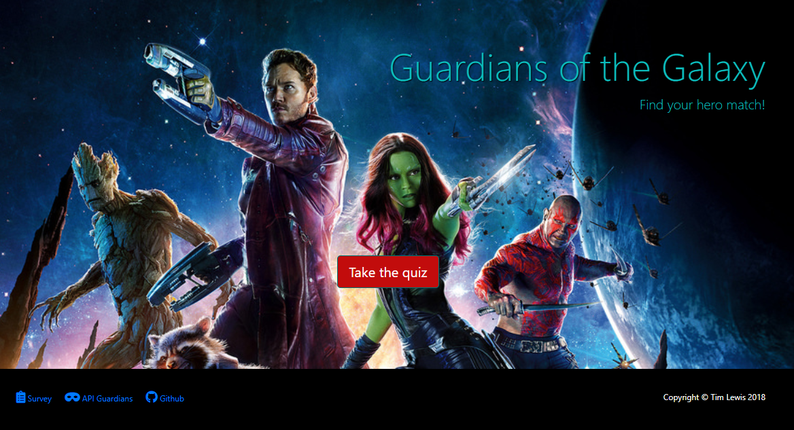
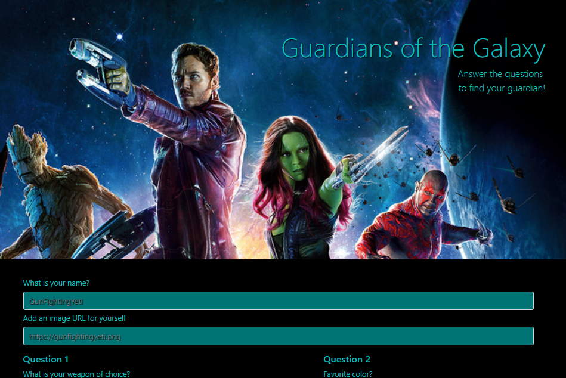
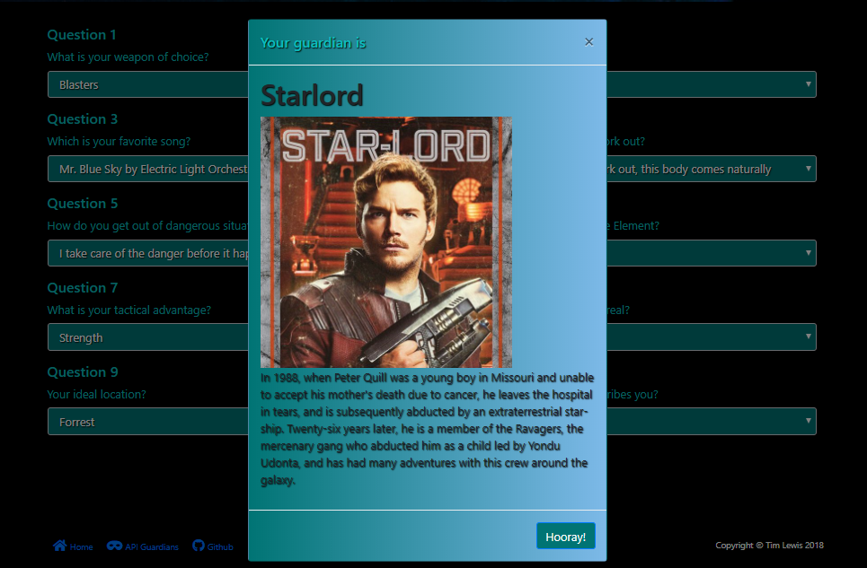

# Guardians of the Galaxy Quiz (Friend Finder)
[View the working site here](https://enigmatic-depths-79110.herokuapp.com/ "Guardians Quiz")

Image

## Here's how the program works

### Press a button!
#### If you have always wondered what Guardian of the Galaxy you are most like then you have come to the right place.  This quiz will ask you ten questions, compare your answers to the *actual* answers of the guardians and find out which Guardian you are most like.   

#### After landing on the home page you need to be decisive and click the "Take the Quiz" button.  Otherwise, you're not cut out to be a Guardian.  They need to be able to press buttons when the time comes.

#### If you've summoned up the courage to join the Guardians and pressed a single button then congratulations, you've passed!  You're well on your way to being compare to someone else.  You will then be directed to page two, where the magic really happens.

### Enter two things!

Image

#### Here you will be asked to enter your name, to be used only for future hero purposes.  As well as a heroic image of yourself.  Please keep it clean as this image will be used for your trading cards should you be chosen.

### Answer some questions!

Image

#### Now, the part for which you've been waiting. Choose answers to these ten questions and you will be compared, scrutinized and judged as a person to find out which Guardian you are most like. (Your information will also be saved and used for future hero needs)

### Receive the knowledge!

Image

#### Bask in the similarities between you and another person!

 

## Getting Started: 
### To start the app, you will need to clone the repo to your local machine and install the below programs and dependencies.
#### Once those are installed and running open a terminal window and run the command "node server.js".  "App listening on PORT 8080" should display in the window.  Once that message appears, open up your web browser and go to "localhost:8080".  That's it, you're ready to enjoy the quiz.

## Prerequisites: 
* NodeJS
* Browser of choice (Chrome is prefered)

### Node packages (These are noted in the package.json)
#### Just run the command "npm i" from a terminal window while inside the same directory as server.js to install all dependant packages
* Express
* Path

## Built With: 
* VS Code
* NodeJS

## Authors: 
Tim Lewis

## License
ISC

## Acknowledgments
DU's coding bootcamp for teaching me almost everything that I know 
The Best Friends Gang for helping me when I got stuck
